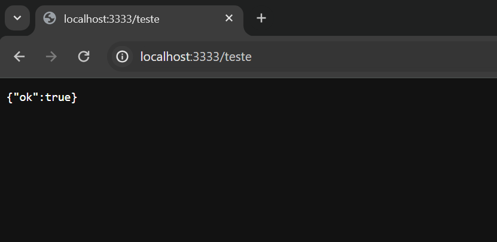

# Documentation for API backend PineappleSoccer 2.0

## Technologies and dependencies

- API written in TypeScript with NodeJS
- Prisma
- Mongodb

---

## Step by step

`npm init`

- to initialize the **_package.json_**

`npm install`

- to initialize the **_package-lock.json_**

`npm install typescript --save-dev`

- to install only in development environment
  - which will bring the **_node_modules_** package and the **TypeScript** dependencies into **_package.json_**

`tsc --init`

- to initialize TypeScript in the project
  - This will create the tsconfig.json file

`npm install fastify @fastify/cors`

- Fastify is a web framework for Node.js known for its speed and efficiency. It is used to create web APIs quickly and efficiently

- Cors is a middleware package for Express.js that allows controlling resource sharing policies between different origins in web applications. It is useful for handling HTTP requests from different origins and allowing or denying access to resources on a server.

`npm install tsx`

- It is a library for running our TypeScript files

`npm install @types/node --save-dev`

- To install Node.js typings

```
  scripts:
    "dev": "tsx watch src/server.ts"
```

- create the 'dev' script in the **_package.json_**

`npm run dev`

- To run the application


## With the configurations of the routes.ts and server.ts files, we obtain our first test GET route




---

- creation of **_README.md_** and **_DOCUMENTATION.md_**

---

## Basic development settings installed and used in the project.

- NodeJS
- Insominia
- Mongodb Atlas
- Prisma ORM
